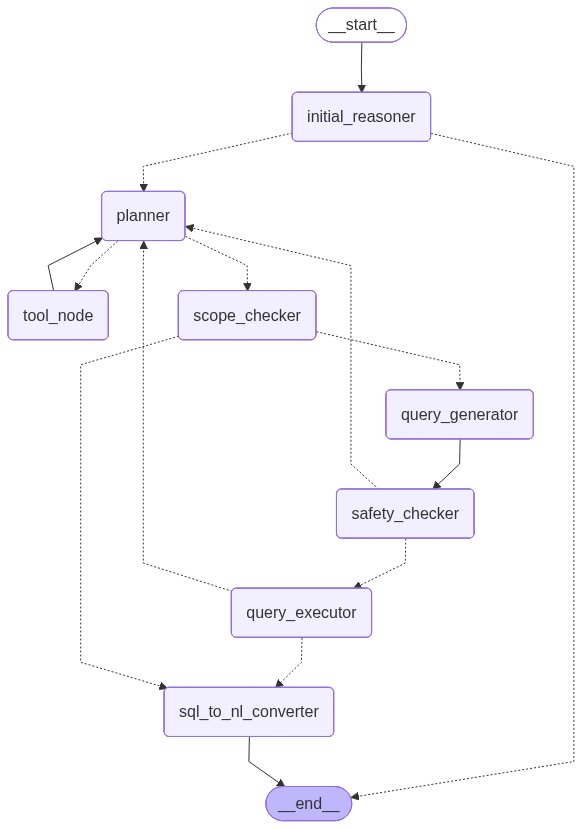

# NL_SQL_Project
An agent chat bot for helping users to get insights on the organization's data

Data analyst agent:
Broad items in the workflow:
1. query-planner (works using db schema + terminology retriever tool),
2. scope filtering
3. query generator,
4. query safety checker, repeat plan if error
5. query executor, repeat plan if error,
6. SQL-Natural language formatter

Steps to Run the agent:
1. Create virtual environment and install all the libraries in requirement.txt
2. go to working directory
3. update your OpenAI_API_Key in the .env file
4. run app.py FastAPI server using the command 'python app.py'
5. run the main.py (client side code) using the command 'python main.py' to write your queries to the chatbot
6. enter 'END' to stop the chat

#Database normalization: (The complete schema file present at ./data/database_schema.txt for your reference)
created different tables representing differnet dimensions
They are:
1. dim_period
2. dim_port
3. dim_facility
4. dim_commodity
5. dim_customer

Remaning tables are created as below by referencing the 
1. fact_balance_sheet
2. fact_cashflow
3. fact_consolidated_pnl
4. fact_quarterly_pnl
5. fact_roce_external
6. fact_roce_internal
7. fact_container_capacity
8. fact_cargo_volumes
9. fact_roro

Current limitations and future scope:
- I used inmemory checkpointer. It can be replaced with database checkpointer
- the workflow and the prompts can be refined
